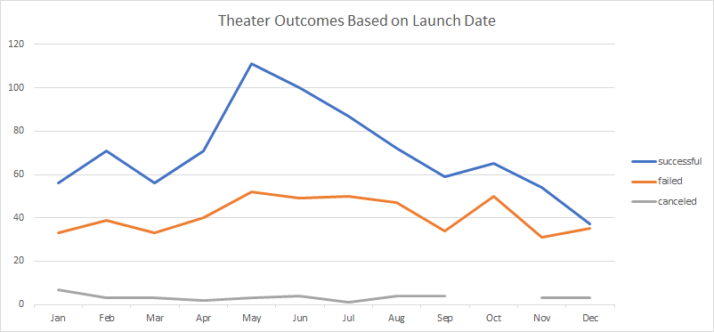
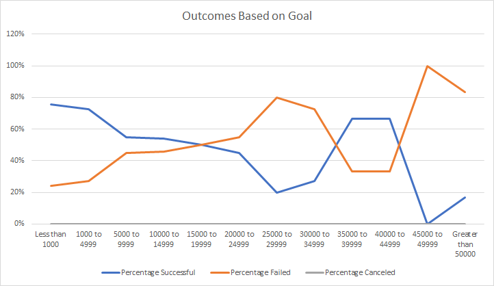

# Kickstarting with Excel

## Overview of Project

### Purpose
The purpose of this project is to define the conditions that drive a successful Kickstarter campaign for theater productions. The analysis looks at the relationship between the month of the year a campaign was launched and its success. Another condition was the how successful a campaign was and the goal of the funds needed. These two simple factors will provide us a timeline and an idea of where to set the target to fund a theater project through Kickstarter. It will lead to other factors to research that will further contribute to having a successful campaign.

## Analysis and Challenges

### Analysis of Outcomes Based on Launch Date
My analysis began with a collection of available Kickstarter data which was combed through for errors, dates converted to be legible and additional columns made for easier categorization. When looking at campaign statuses and the time of year they started, a pivot table was used. The pivot table was filtered looking at only theater projects from the data and then separated in the table by months and successful, failed, and canceled campaigns as the results. Based on this analysis the best time to start a Kickstarter campaign for a theater project is in May. A campaign should not be started during the months at the beginning or end of the year.

### Analysis of Outcomes Based on Goals
The second analysis looked at the goal of a project ranging from less than $1,000 to greater than $50,000 using increments of $5,000 as the scale. The scale populated with data that fit the parameters defined COUNTIF function into successful, failed, and canceled then the percentage rate for those statuses were considered.  This analysis tells us the most successful theater Kickstarter campaigns running a goal amount of less than $14,999 have a greater than 50% chance of succeeding with. Higher campaigns are more likely to fail.

### Challenges and Difficulties Encountered
No challenges were, presented during the analysis. Some possible challenges that could be present are incorrect categorization from faulty data entry by the analyst or whom initiated the campaign, outliers (i.e. unrealistic goals) within the funding received or needed, incomplete data, the information of those who donated, and if the campaigns were shared or advertised over the internet or different mediums. 

## Results

- What are two conclusions you can draw about the Outcomes based on Launch Date?
Analyzing theater outcomes by launch date we can see that the most of the successful campaigns occurred over the months of May, June and August. The success rate tapered off as the year comes to a close. October has the highest amount of failed campaigns during the year. The most successful months come close to matching October in terms of failed campaigns but that is due to the amount of campaigns. Based on these readings the recommendation would be to launch a theater campaign in May.

- What can you conclude about the Outcomes based on Goals?
The second analysis involved campaign goals and their outcomes. There is a correlation as the higher the goal the less likely the campaign will be successful. This holds true with the exception of campaign goals ranging from $35,000 to $39,999 and $40,000 to $44,999 being 67% successful despite other brackets before it failing. More research is needed as to why. One conclusion that could be drawn is to run a campaign less than $15,000 to have better than 50% chance of success.

- What are some limitations of this dataset?
Two limitations within this dataset is the timeframe and goal brackets that are set up.  Another limitation that is apparent the broad range of types of theater productions. These limitations could distort the results we are seeing compared to a narrower scope of the project. 

- What are some other possible tables and/or graphs that we could create?
Some other tables or graphs that would be extremely helpful would analyze some of these weaknesses. For example, a graph that examines if the success of a campaign during the months of May, June and July remain year over year. Tables that break down the goal brackets even more would be beneficial to set a well-defined goal or chances if one’s goal falls within a bracket that is close to or at 50% chances of success. Of course, another analysis should be run on all these factors looking at the different subcategories of theater productions as specific types may not be a successful as others.

